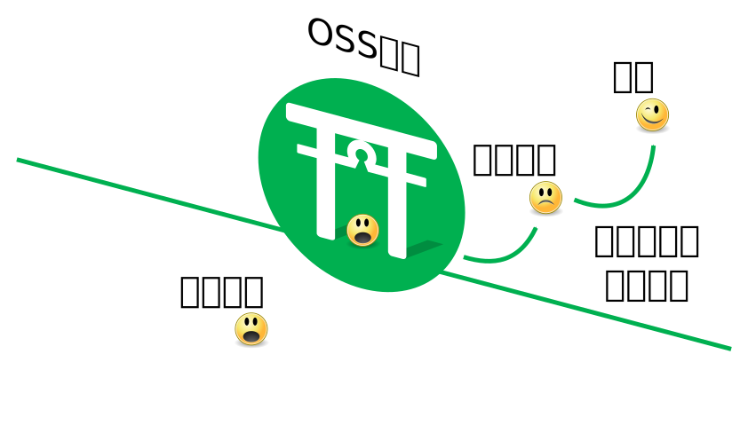

# OSS Gateの紹介

author
:   OSS Gate

theme
:   clear-blue

allotted-time
:   5m

# OSS Gate？

{:relative_width="30" align="right" relative_margin_right="23"}

{:.center .x-large}
OSSの門？

# 門

{:.center .x-large}
境界にあるもの

# 扱う境界

{:relative_width="100"}

# ターゲット

{:relative_width="100"}

# やりたいこと

{:relative_width="100"}

# 未参加者→参加者

{:relative_width="100"}

# ワークショップの内容

  * {::wait/}未参加者の後押し
    * すでに興味はある！
  * {::wait/}どう後押せば…？

# 未参加の理由？

  1. {::wait/}やり方がわからない
  2. {::wait/}なんとなく不安

# ワークショップの内容

  1. {::wait/}やり方を1つ教える
     * やり方がわかると参加できる！
  2. {::wait/}OSSの開発に実際に参加する
     * 不安なのは*未経験*だから
     * ワークショップで経験しよう！

# 門をくぐる

{:relative_width="100"}

# よりくぐりやすく

{:relative_width="100"}

# くぐってからも継続

{:relative_width="100"}

# 集まれ！

{:relative_width="100"}

# まとめ1

  * OSS Gate
    * {::wait/}OSS開発参加者を増やす取り組み

# まとめ2

  * OSS Gateワークショップ
    * {::wait/}OSS開発参加者を増やす方法の1つ
    * {::wait/}ターゲット：未参加者
    * {::wait/}東京・札幌・大阪で開催中！
      * もっと開催地域を増やしたい！
    * {::wait/}開催予定情報：
      https://oss-gate.doorkeeper.jp/

# まとめ3

  * OSS Gate○○
    * {::wait/}継続的な開発参加者を増やす方法
    * {::wait/}ターゲット：門をくぐった人
    * {::wait/}東京で実験中
    * {::wait/}開催予定情報：
      https://oss-gate.doorkeeper.jp/
